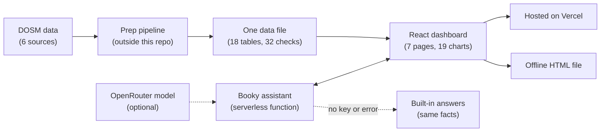

# VulneraMy: Employment Analytics for Malaysian Tourism

An interactive dashboard built for the DOSM Datathon 2026. It shows that Malaysia's official tourism job numbers look steady, but the jobs that truly depend on visitors are far more fragile. It ships two ways: a hosted web app and a single offline HTML file that opens with a double-click.

- **Live demo:** [vulnera-my.vercel.app](https://vulnera-my.vercel.app)
- **Team:** TERPALING DATA (MMU)
- **Data:** official DOSM statistics only
- **Built with:** React, TypeScript, D3, Tailwind CSS, Zustand, Vite, Vercel

## The big idea

The official headline says tourism supports about **3.5 million jobs**. That is true, but it counts everyone working in tourism industries, even if no visitor ever pays their wage.

DOSM also publishes, for each industry, the share of its business that comes from tourism. Multiply each industry's jobs by that share and add them up. The result is what this project calls **tourism-dependent jobs**: the jobs that would disappear if visitors stopped coming.

Both numbers come from the same two official tables. Only the question is different, and the answers are very different. Every figure names its time window, because the window changes the story.

| Window | Headline jobs | Tourism-dependent jobs |
|---|---|---|
| 2019 to 2021 | -5.5% (3.32M to 3.14M) | -79.1% (1.27M to 266K) |
| 2015 to 2024, peak to low point | -24.1% | -79.9%, about 3.3 times deeper |

## What the dashboard found

- **The headline hides the shock.** From 2019 to 2021, tourism-dependent jobs fell about 14 times more than the headline did. A plan built for a 6% shock is far too small for an 80% one.
- **A full recovery on paper only.** By 2024 tourism-dependent jobs were back to 104.2% of 2019. But travel agencies were down 36.8% while culture and recreation were up 20.6%, a gap of 57 points. Support should be redirected, not withdrawn.
- **Some spending creates far more jobs.** RM1 million in food and drink supports 11.6 tourism-dependent jobs. The same amount in fuel retail supports 0.7, about 16 times fewer.
- **Exposed is not the same as crowded.** All 16 states get a vulnerability score from 38.7 (Sabah) to 78.4 (W.P. Labuan), with a median of 50.1. The most vulnerable states are not the busiest ones.
- **Demand depends on too few sources.** One neighbouring country supplies 46.9% of 2024 arrivals (concentration score 2,544, just above the 2,500 high-risk line). A quarter of domestic trips (25.6%) stay in the traveller's home state. In Sabah it is 77.6% and in Sarawak 80.0%.
- **The jobs pay less.** In 2024, median pay in tourism industries averaged RM1,985 against RM2,793 nationally. Accommodation and food paid RM1,912 (68.5%) and never passed 72% of the national median from 2010 to 2024.

## The seven pages

| Page | Question it answers |
|---|---|
| Overview | How big is tourism employment, and how much of it depends on visitors? |
| Structural Analysis | Which industries gained or lost tourism-dependent jobs, and when? |
| Geographical Analysis | Which states are most exposed? |
| Market and Flows | Where does demand come from, abroad and between states? |
| Simulation | Where should the next tourism budget go to create the most jobs? |
| Decent Work | Are these jobs well paid? |
| SDG Alignment | What can honestly be claimed against the UN tourism indicators? |

All pages share the same year, state and sector filters, so no two pages can show different numbers.

## How it works



- Official data is collected, cleaned and combined into one JSON file.
- The app loads that file in the browser, so no chart waits on a live database.
- The hosted version adds the Booky assistant. The offline version makes no network requests at all.

## Tech stack and what each tool does

| Tool | Its job here |
|---|---|
| React 19 and TypeScript | Build the seven pages and catch type errors in app and server code |
| D3 v7 | Draws all 19 charts by hand, so a click on any chart can filter every other chart |
| Tailwind CSS v4 | One consistent look: navy for values, red only for decline |
| Zustand | Keeps the shared year, state and sector filters in one place |
| Vite with vite-plugin-singlefile | Builds the app, and packs everything into one offline HTML file |
| Vercel and serverless functions | Host the app and run the Booky endpoint without managing a server |
| OpenRouter (DeepSeek model) | The language model behind Booky, set through three environment variables |
| oxlint | Quick code checks across a large set of components |

## The data

Everything comes from official DOSM publications, downloaded or scraped from OpenDOSM and eStatistik. No third-party, proprietary or made-up data is used.

| Source | Years | Used for |
|---|---|---|
| Tourism Satellite Account | 2015 to 2024 | Spending, jobs by industry, tourism shares |
| Domestic Tourism Survey | 2018 to 2024 | Visitors, spending, trips, state-to-state flows |
| International arrivals | 58 months from Jan 2020 | Monthly arrivals by country |
| Salaries and Wages Survey | 2010 to 2024 | Median pay by industry |
| Population estimates | 2024 | Visitors per resident |
| SDG indicators | 2015 to 2024 | Indicators 8.9.1 and 12.b.1 |

What the data cannot tell you:

- It cannot support an environmental claim, so the project makes none.
- Arrivals are counted at entry points, so someone crossing two borders can be counted twice. Share figures use DOSM's national-total series instead.
- There is no data on individual people or households.

## How the data was prepared

1. **Collect** the six source families from official DOSM channels.
2. **Combine** them into 18 tables with matching units and years (927 rows across the 16 list tables).
3. **Check** them with 32 automated tests (totals add up across states, units and ranges make sense, nothing is missing or infinite). All 32 pass.
4. **Calculate** tourism-dependent jobs. In 2024: 3,537.8K headline jobs and 1,324.3K tourism-dependent jobs (37.43%).
5. **Score** all 16 states on the vulnerability index.
6. **Solve** the budget allocation for RM5,000M.
7. **Ship** one file, `public/dashboard_data.json`, built on 2026-09-20.

The prep pipeline sits outside this repo, so row counts before cleaning are not recorded here.

## Methods in short

- **Tourism-dependent jobs:** each industry's jobs times its tourism share, added up.
- **Biggest drop (drawdown):** the deepest fall from a peak to the later low. The window is always stated.
- **Swing measure (coefficient of variation):** standard deviation divided by the average, 2015 to 2024. Headline jobs: 7.1%. Tourism-dependent jobs: 35.8%, about five times wilder.
- **Job density:** tourism-dependent jobs per RM1 million spent in an industry.
- **Absorption cap:** the most an industry can take in during a normal year, based on its own best year of spending growth from 2015 to 2019 (2% minimum).
- **Concentration score (HHI):** each market's share squared, then added up, on a 0 to 10,000 scale. Above 2,500 means high concentration.
- **Vulnerability index:** four parts: income instability, incomplete recovery, outside dependence and weak local capture. The weights are stated in the research report and were stress-tested.

### Models I tried and did not ship

All three lost to simple baselines, so none reached the dashboard. A basic seasonal guess beating a fitted model also supports the project's point that tourism is volatile.

| Question | Model | Result |
|---|---|---|
| Forecast monthly arrivals | Ridge panel model | Error of 34.4 against 23.4 for a seasonal guess |
| Group the states into types | K-Means | Silhouette score of 0.31, no clear groups |
| Explain tourism pressure | Ridge regression | R-squared of 0.56 against 0.0 for the mean, explains but does not predict |

## The simulation

- Runs live in the browser and re-solves for any budget on a slider.
- It fills industries in order of job density until the budget or each industry's cap runs out.
- At RM5 billion it matches a benchmark solved separately: 50.15K jobs against 32.21K under the status quo (+55.7%, or 17.9K more jobs). The cost per job drops from RM155,231 to RM99,701.
- It compares ways of splitting a budget. It is not a budget instruction.

## Booky, the chart assistant

- Every chart has a chat that answers questions about that chart in plain language.
- The server limits input length, rate-limits each address, and only accepts chart IDs from a fixed list.
- Chart facts are worked out by normal code from the bundled data. Only that fact text goes to the language model, never raw data.
- If no model is set up, or the call fails or times out, the same facts are returned directly.
- No key exists in the browser code. The offline build was scanned and none was found.

## Offline build

One codebase makes both versions. The offline version sets `VITE_OFFLINE_ONLY=true` and produces a single HTML file with the code, styles, images and data inside. Its only outside reference is a web font, which falls back to system fonts without internet.

```bash
npm install
npm run dev                                   # local dev server
VITE_OFFLINE_ONLY=true npm run build          # builds one dist/index.html
```

## Checks and known limits

- 32 of 32 data checks pass, and the simulation matches its separately solved benchmark.
- A manual review caught two problems the checks missed: a drawdown that ignored time order, and arrivals counted at every entry point.
- **Market panel:** the live dashboard's market panel still uses monthly arrivals that double-count entry points (top market 66.8%, HHI 5,380 for 2024). The 46.9% and 2,544 figures above use DOSM's national-total series. A third value, 50.34%, sits in the data file's `benchmarks` table. A fix is planned.
- **Booky:** for two charts (pressure quadrant and state vulnerability), the hosted and offline assistants can answer from different datasets. Not fixed yet.
- **Pipeline and report:** the prep pipeline and the research report are not in this repo, so only the shipped data file can be checked from here.
