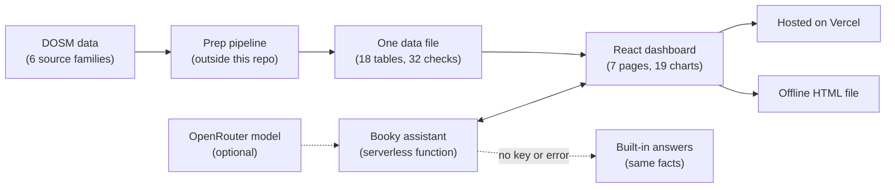

# VulneraMy: Employment Analytics for Malaysian Tourism

An interactive dashboard built for the DOSM Datathon 2026. Malaysia's official headline says tourism supports about 3.5 million jobs. That is true, but a second official measure, built from the same two tables, shows that the jobs that truly depend on visitors are far more fragile. The dashboard ships two ways: a hosted web app and a single offline HTML file that opens with a double-click.

- **Live demo:** [vulnera-my.vercel.app](https://vulnera-my.vercel.app)
- **Team:** TERPALING DATA, Multimedia University (MMU), supervised by Dr. Prabha Kumaresan
- **Data:** official DOSM statistics only (links in [The data](#the-data-and-official-sources))
- **Built with:** React, TypeScript, D3, Tailwind CSS, Zustand, Vite, Vercel

## The big idea

DOSM's [Tourism Satellite Account 2024](https://www.dosm.gov.my/portal-main/release-content/tourism-satellite-account-2024) puts tourism employment in 2024 at 3.5 million people, 21.6% of all jobs. That headline counts everyone working in tourism industries, even if no visitor ever pays their wage.

The same publication gives each industry's **tourism share**: the part of its business that comes from visitors. Multiply each industry's jobs by that share and add them up. The result is **tourism-dependent jobs**, the jobs that would disappear if visitors stopped coming. The formal name in the research report is *tourism-attributable employment*.

Both numbers come from the same two official tables. Only the question is different.

| Window | Headline jobs | Tourism-dependent jobs |
|---|---|---|
| 2019 to 2021 | -5.5% (3.32M to 3.14M) | -79.1% (1.27M to 266K) |

This is also the worst fall either series has anywhere in 2015 to 2024. Headline jobs actually grew from 2.68M in 2015 to 3.54M in 2024.

Tourism-dependent jobs are a modelled measure (industry jobs times an industry-average share). The 79% fall means the visitor-driven part of the work collapsed. It does not mean 79% of workers lost their jobs, which is why the headline barely moved.

## What the dashboard found

- **The headline hides the shock.** From 2019 to 2021, tourism-dependent jobs fell about 14 times more than the headline. They also swing five times more from year to year (swing measure 35.8% vs 7.1%). Tourism Direct GDP tells the same story: it fell from 6.76% of GDP in 2019 to 0.75% in 2021, then recovered to 6.23% in 2024.
- **A full recovery on paper only.** By 2024, tourism-dependent jobs were back to 104.2% of 2019. But travel agencies were down 36.8% while culture and recreation were up 20.6%, a gap of 57 points. Three industries (retail, food and drink, accommodation) hold 86% of all tourism-dependent jobs.
- **Some spending creates far more jobs.** RM1 million in food and drink supports 11.6 tourism-dependent jobs. The same amount in fuel retail supports 0.7, about 16 times fewer.
- **Exposed is not the same as crowded.** All 16 states get a vulnerability score from 38.7 (Sabah) to 78.4 (W.P. Labuan), median 50.1. The most vulnerable states are not the busiest ones.
- **Demand depends on too few sources.** Singapore is the top market. The report's national-total series puts it at about 47% of 2024 arrivals, with a concentration score of 2,544, just above the 2,500 high-risk line (see known limits). At home, a quarter of domestic trips (25.6%) stay in the traveller's own state. In Sabah it is 77.6% and in Sarawak 80.0%.
- **The jobs pay less.** Across the eight tourism industries, median pay averages RM1,985 against RM2,793 nationally (71.1%). Accommodation and food pays RM1,912 (68.5%) and never passed 72% of the national median from 2010 to 2024.

## The seven pages

| Page | Question it answers |
|---|---|
| Overview | How big is tourism employment, and how much of it depends on visitors? |
| Structural Analysis | Which industries gained or lost tourism-dependent jobs, and when? |
| Geographical Analysis | Which states are most exposed? |
| Market and Flows | Where does demand come from, abroad and between states? |
| Simulation | Where should the next tourism budget go to create the most jobs? |
| Decent Work | Are these jobs well paid? |
| SDG Alignment | What can honestly be claimed against the UN tourism indicators? |

All pages share the same year, state and sector filters, so no two pages can show different numbers.

## How it works



- Official data is collected, cleaned and combined into one JSON file.
- The app loads that file in the browser, so no chart waits on a live database.
- The hosted version adds the Booky assistant. The offline version makes no network requests at all.

## Tech stack and what each tool does

| Tool | Its job here |
|---|---|
| React 19 and TypeScript | Build the seven pages and catch type errors in app and server code |
| D3 v7 | Draws all 19 charts by hand, so a click on any chart can filter every other chart |
| Tailwind CSS v4 | One consistent look: navy for values, red only for decline |
| Zustand | Keeps the shared year, state and sector filters in one place |
| Vite with vite-plugin-singlefile | Builds the app and packs everything into one offline HTML file |
| Vercel and serverless functions | Host the app and run the Booky endpoint without managing a server |
| OpenRouter (DeepSeek model) | The language model behind Booky, set through three environment variables |
| oxlint | Quick code checks across a large set of components |

## The data and official sources

Everything comes from official statistics. No third-party, proprietary or made-up data is used. The main portals are [DOSM](https://www.dosm.gov.my) and [OpenDOSM](https://open.dosm.gov.my).

| Source | Years | Used for | Official links |
|---|---|---|---|
| Tourism Satellite Account (Tables 1, 2, 4, 6, 7) | 2015 to 2024 | Spending, jobs by industry, tourism shares, Tourism Direct GDP | [TSA 2024 release](https://www.dosm.gov.my/portal-main/release-content/tourism-satellite-account-2024), [release archive (earlier years)](https://www.dosm.gov.my/portal-main/release-archive/tourism-satellite-account-2024) |
| Domestic Tourism Survey | 2018 to 2024 (flows: 2024) | Visitors, spending, trips, state-to-state flows | [DTS 2024 report (PDF)](https://www.dosm.gov.my/uploads/release-content/file_20250626162450.pdf), [DTS by state 2024](https://dosm.gov.my/portal-main/release-content/domestic-tourism-survey-states-2024) |
| International arrivals | Jan 2020 to Oct 2024 (58 months) | Monthly foreign arrivals by country and state of entry (Immigration Department records) | [Monthly foreign arrivals by state of entry](https://data.gov.my/data-catalogue/arrivals_soe) |
| Salaries and Wages Survey | 2010 to 2024 | Median pay by industry | [Report 2024 release](https://www.dosm.gov.my/portal-main/release-content/salaries-and-wages-survey-report-2024), [PDF](https://storage.dosm.gov.my/labour/salaries_wages_2024.pdf) |
| Population estimates | 2024 | Visitors per resident | [Current Population Estimates 2024](https://www.dosm.gov.my/portal-main/release-content/current-population-estimates-2024), [PDF](https://storage.dosm.gov.my/demography/population_2024.pdf) |
| SDG indicators 8.9.1 and 12.b.1 | 2015 to 2024 | The two official UN tourism indicators | [DOSM SDG Indicators, Malaysia 2024 (PDF)](https://www.dosm.gov.my/uploads/release-content/file_20260121104206.pdf), [UN Tourism indicator data](https://unwto.org/tourism-statistics/economic-contribution-SDG) |

**Coverage note:** the data runs to 2024, using the TSA 2024 release (published September 2025). DOSM released the TSA 2025 on 15 September 2026, shortly before this version's data file was built, so it is not included here.

What the data cannot tell you:

- **No environmental claim.** The water, energy and emissions accounts are not broken down to tourism, and the solid-waste account is not published, so the project makes no sustainability claim.
- **Arrivals can be double counted.** They are recorded by point of entry, so national measures should use the national-total row.
- **Pay covers citizens in formal jobs only.** It describes the industries that carry tourism jobs, not tourism jobs themselves.
- **Two series are short.** The state-to-state matrix covers one year (2024) and arrivals start in 2020, so neither has a pre-pandemic baseline.
- **No data on individual people or households.**

## How the data was prepared

1. **Collect** the six source families from the official DOSM channels above.
2. **Combine** them into 18 tables with matching units (money in RM million, jobs in thousands) and matching industry and state codes (927 rows across the 16 list tables).
3. **Check** them with 32 automated tests (totals add up across states, units and ranges make sense, nothing is missing or infinite). All 32 pass.
4. **Calculate** tourism-dependent jobs. In 2024: 3,537.8K headline jobs and 1,324.3K tourism-dependent jobs (37.4%).
5. **Score** all 16 states on the vulnerability index.
6. **Solve** the budget allocation for RM5,000M.
7. **Ship** one file, `public/dashboard_data.json`, built on 2026-09-20.

The prep pipeline sits outside this repo, so row counts before cleaning are not recorded here.

## Methods in short

- **Tourism-dependent jobs:** each industry's jobs times its tourism share, added up.
- **Biggest drop (drawdown):** the deepest fall from a running high to a *later* low. The high must come before the low.
- **Swing measure (coefficient of variation):** standard deviation divided by the average, 2015 to 2024. Headline jobs 7.1%, tourism-dependent jobs 35.8%.
- **Job density:** tourism-dependent jobs per RM1 million spent in an industry.
- **Absorption cap:** the most an industry can take in during a normal year. It is the industry's 2024 tourism spending times its best single-year growth in 2015 to 2019, with a 2% minimum.
- **Concentration score (HHI):** each market's share squared, then added up, on a 0 to 10,000 scale. Above 2,500 means high concentration.
- **Vulnerability index:** four parts with stated weights: income instability (30%), incomplete recovery (30%), outside dependence (20%) and weak local capture (20%). With equal weights the state ranking barely changes (Spearman 0.97).

### Models tested and not shipped

All of them lost to simple baselines, so none reached the dashboard. A seasonal guess beating a fitted model also fits the project's point that tourism is volatile.

| Question | Model | Error vs a simple baseline |
|---|---|---|
| Forecast monthly arrivals | Ridge panel model | 34.4% vs 23.4% (seasonal guess) |
| Predict state tourism receipts | Random forest | 27.5% vs 22.7% (visitors times average spend) |
| Predict recovery against 2019 | Ridge regression | 16.3% vs 14.9% (the national mean) |
| Group the states into types | K-Means | Silhouette 0.28 to 0.31, no clear groups, not used |

## The simulation

- Runs live in the browser and re-solves for any budget from RM500 million to RM10 billion on a slider.
- It fills industries in order of job density until the budget or each industry's cap runs out.
- At RM5 billion it matches a benchmark solved separately: 50.15K jobs against 32.21K under the status quo (+55.7%, or 17.9K more jobs). The cost per job drops from RM155,231 to RM99,701.
- It compares ways of splitting a budget. It is not a budget instruction, and it assumes steady returns inside each cap.

## Booky, the chart assistant

- Every chart has a chat that answers questions about that chart in plain language.
- The server limits input to 500 characters, rate-limits each address, and only accepts chart IDs from a fixed list.
- Chart facts are worked out by normal code from the bundled data. Only that fact text goes to the language model, never raw data.
- If no model is set up, or the call fails or times out, the same facts are returned directly. Built-in answers separate what was observed, calculated and interpreted, and end with a limitation line.
- No key exists in the browser code. The offline build was scanned and none was found.

## Offline build

One codebase makes both versions. The offline version sets `VITE_OFFLINE_ONLY=true` and produces a single HTML file with the code, styles, images and data inside. Its only outside reference is a web font, which falls back to system fonts without internet.

```bash
npm install
npm run dev                                   # local dev server
VITE_OFFLINE_ONLY=true npm run build          # builds one dist/index.html
```

## Checks and known limits

32 of 32 data checks pass, and the simulation matches its separately solved benchmark. A review found two problems the checks missed, and both still need a final fix in the pipeline:

- **Overview drawdown cards.** They show -79.9% and -24.1% "peak to trough". Those figures measure from the 2024 level back to an earlier low, which is the wrong order in time (headline jobs actually grew over that period). The correct figures are -79.1% and -5.5%, as used in this README.
- **Market panel.** It adds up arrivals across entry points, which double-counts. It shows a concentration score of 5,380 and a top-market share of 66.8% for 2024. The report's national-total figures (about 47% for Singapore, score 2,544) are not in the shipped data file, so they cannot be checked from this repo.

Other limits:

- **Assistant charts:** for two charts (pressure quadrant and state vulnerability), the hosted and offline assistants may answer from different datasets.
- **Modelled measure:** tourism shares are industry averages, so the tourism-dependent job count is exact by industry and only indicative below that.
- **Judgement calls:** the vulnerability index weights and the absorption caps are the team's choices, not published statistics.
- **Assistant wording:** the language model's phrasing was not formally evaluated. The built-in answers are the reference.
- **Arrivals are not only tourists:** the source counts foreign arrivals recorded by Immigration at all entry points, so a market like Singapore may include non-tourist trips such as daily cross-border travel.
- **Pipeline and report:** the prep pipeline and the research report are not in this repo, so only the shipped data file can be checked from here.
