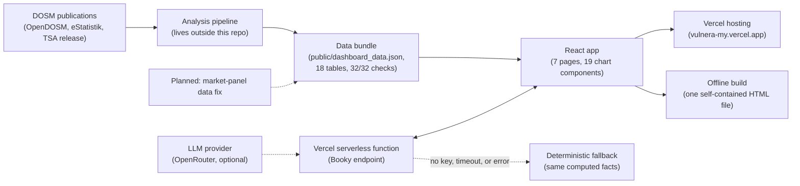

# VulneraMy: Employment Analytics for Malaysian Tourism

VulneraMy is an interactive analytics dashboard built for the DOSM Datathon 2026. Its argument is easy to say and easy to miss. **Malaysia's official headline number says tourism supports about 3.5 million jobs.** That number is true, and the official series makes tourism work look steady, yet it hides how unstable the work really is. Isolate only the jobs that genuinely depend on visitors and four in five of them disappeared at the pandemic trough (2019 to 2021), while the headline recorded a fall of about one job in twenty.

Every headline figure below names its window, because the window changes the size of the story:

| Window | Headline employment | Tourism-dependent jobs |
|---|---|---|
| 2019 to 2021 | -5.5% (3.32M to 3.14M) | -79.1% (1.27M to 266K) |
| 2015 to 2024, peak to trough | -24.1% | -79.9%, about 3.3 times as deep |

The dashboard follows that argument across seven pages and ends with a decision tool rather than a stack of charts. It ships in two forms: a hosted web app on Vercel, and a single offline HTML file that opens by double-click with no server and no internet.

<!-- Screenshot or GIF slot: ask Arief for the real image before adding one. Do not invent it. -->

| Component | Note |
|---|---|
| Live | [vulnera-my.vercel.app](https://vulnera-my.vercel.app) |
| Built with | React 19, TypeScript, D3 v7, Tailwind CSS, Zustand, Vite |
| Backend | Vercel serverless functions |
| AI assistant | "Booky", a per-chart chat with a deterministic offline fallback |
| Data | Official DOSM statistics only, bundled as one JSON file |
| Deliverable | Hosted app plus a self-contained offline HTML file |
| Team | TERPALING DATA (MMU), DOSM Datathon 2026. No placement is claimed. |

---

## The core idea in plain words

Tourism is not one industry. It is a pattern of spending that runs through retail, food and beverage, accommodation, transport and more. Because of that, the official headline counts everyone employed in tourism industries, whether or not a visitor ever pays their wage.

The Tourism Satellite Account, which is the accepted international method for measuring tourism's economic weight, publishes something more precise beside the headline. For each industry it gives the share of that industry's business that comes from tourism. Multiply each industry's employment by its share, add the results together, and you get the count of jobs that would genuinely vanish if tourism demand disappeared. This project calls them **tourism-dependent jobs**. The formal name in the research report is *tourism-attributable employment*.

Both numbers come from the same two published tables. The only difference is the question you ask them. And the answers differ enormously.

| Term used here | Plain meaning |
|---|---|
| Headline employment | Everyone working in tourism industries, the published official count |
| Tourism-dependent jobs | Only the jobs actually sustained by visitor spending |
| Tourism ratio | The share of an industry's business that comes from tourism, published in the satellite account |
| Drawdown | The deepest fall from a peak to the later low, which is what workers actually experience |
| Coefficient of variation | A scale-free measure of how wildly a number swings year to year |
| Job density | Tourism-dependent jobs created per RM1 million spent in an industry |
| Absorption cap | The most an industry has ever taken in during a single normal year, used as a realistic spending limit |
| HHI (concentration index) | A 0 to 10,000 score of how much demand depends on one source market, where above 2,500 means high concentration |
| Surrogate key | An ID made up for a row so charts can join to it without exposing the original code |
| Cross-filter | Click a state or year and every other chart narrows to the same selection |

## What the dashboard argues, page by page

Every page reads from one integrated data base and shares the same global filters for year, state and sector, so a selection made on one page carries through the whole argument and no two pages can disagree about a number.

| Page | The question it answers |
|---|---|
| Overview | How large is tourism employment, and how much of it truly depends on visitors? |
| Structural Analysis | Which industries gained and lost tourism-dependent jobs, and when? |
| Geographical Analysis | Which states carry the exposure, ranked by a reproducible vulnerability index? |
| Market and Flows | Where does demand actually come from, internationally and between states? |
| Simulation | Where should the next tourism budget go to create the most jobs? |
| Decent Work | Are these jobs any good once you look at what they pay? |
| SDG Alignment | What can honestly be claimed against the official UN tourism indicators? |

## The findings behind those pages

Six findings carry the argument, and every number below was recomputed from the bundled data for this README, with the source table named.

The headline understates the shock fourteen-fold. Over 2019 to 2021, headline employment fell 5.5% while tourism-dependent jobs fell 79.1%, from 1.27 million to 266 thousand. Their swings differ about fourteen times. Any contingency plan sized against a 6% shock is undersized against an 80% one. Measured over the full 2015 to 2024 peak to trough instead, the same two series fall 24.1% and 79.9%, a ratio of about 3.3. Both windows are honest; the fourteen-fold number only holds for the pandemic window, and the dashboard states the window next to every figure.

The aggregate recovery hides a redistribution. Tourism-dependent employment reached 104.2% of its 2019 level by 2024, which reads as a full recovery. By industry it is not. Travel agencies lost more than a third of their tourism-dependent jobs (-36.8% from 2019 to 2024) while culture and recreation gained a fifth (+20.6%), a spread of 57 percentage points. For three industries the two measures move in opposite directions (culture and recreation, other services, and transport), so the headline would rank the wrong winners and losers. A recovered total is a reason to re-target support, not to withdraw it.

Job density varies sixteen-fold. A million ringgit spent in food and beverage supports 11.6 tourism-dependent jobs. The same ringgit in fuel retail supports 0.7. The employment consequence of tourism spending is set as much by where it goes as by how large it is.

Exposure is not the same as crowding. The dashboard scores all 16 states on a composite vulnerability index built from income instability, incomplete recovery, external dependence and weak local capture, with weights stated openly in the report and stress-tested. Scores run from Sabah at 38.7 to W.P. Labuan at 78.4, median 50.1. The most vulnerable states are not the busiest. Crowding and fragility need opposite instruments, and the quadrant view keeps them apart at a glance.

Demand is dangerously concentrated. On the international side, the concentration index sat at the official high-concentration threshold in 2024, with one neighbouring country supplying 46.9% of 2024 arrivals out of roughly 195 source markets (national-total series from the report; see Validation for the two other values this project has recorded). Domestically, a quarter of all trips in 2024 (25.6%) never leave the traveller's home state, and East Malaysia is largely a separate market (Sabah 77.6% and Sarawak 80.0% of trips stay at home). Campaigns aimed at the wrong origin will not move demand.

Every tourism-carrying industry pays below the national median. Weighted by tourism-dependent employment across the eight tourism industries in 2024, median pay averages RM1,985 against a national RM2,793. Accommodation and food specifically sits at RM1,912, or 68.5% of the national figure. That industry never exceeded 72% of the national median at any point from 2010 to 2024 (peak 71.8% in 2018). This is a fifteen-year structural position, and it qualifies the allocation result rather than overturning it.

## Architecture



How the diagram works, step by step. The official DOSM publications are collected and harmonised into one JSON file, the data bundle, which is the only data artifact the dashboard reads. The React app loads that file in the browser, so no chart ever queries a database live. The hosted build on Vercel serves the same code and adds Booky, the assistant, which runs in a serverless function. The offline build inlines code, styles, images and data into a single HTML file and never makes a network request. Everything drawn with solid lines is built and shipped today. The dotted node on the right, the market-panel data fix, is planned but not done.

## Tech stack and what each tool does

Every one of the 19 chart components is hand-built with D3 rather than pulled from a chart library, which is what allows the global cross-filtering and the design system to apply consistently.

| Tool | What it does here |
|---|---|
| React 19 | Component model for the 7 pages of tightly related views |
| TypeScript 6 | End-to-end type safety across client and serverless code |
| D3 v7 | Draws every chart by hand, needed for click-to-filter behavior across all 19 visuals |
| Tailwind CSS v4 | One design system, single navy accent for values, red reserved for decline |
| Zustand 5 | One global store holding the shared year, state and sector filters |
| Vite 8 with vite-plugin-singlefile | Bundles JS, CSS, images and the full data base into one offline HTML file |
| oxlint | Fast static checks in a large component tree |
| Vercel serverless functions (Node, `@vercel/node`) | Runs the Booky assistant endpoint with zero infrastructure to manage |
| OpenRouter serving DeepSeek (OpenAI-compatible API) | The model behind Booky, swappable through three environment variables, with a deterministic fallback when unset |
| Vercel (hosted) plus the offline HTML artifact | Two deliverables from one codebase |
| Data bundle (`public/dashboard_data.json`) | The single file the app reads; 18 tables, no hidden transformation sits between the published statistics and a rendered chart |

## The dataset

All data is official Malaysian statistics, collected from DOSM's own publishing channels. Time series such as labour force, population and the satellite-account tables were downloaded and scraped programmatically from the OpenDOSM bulk-data endpoints at [storage.dosm.gov.my](https://storage.dosm.gov.my), which is the machine-readable arm of the official [Department of Statistics Malaysia portal](https://www.dosm.gov.my). The Domestic Tourism Survey workbooks, including the state receipts tables and the origin-destination matrix, were downloaded from the [eStatistik portal](https://www.open.dosm.gov.my), and the Tourism Satellite Account tables were taken from DOSM's official publication release. Everything was then harmonised into a single integrated base of 18 tables.

| Source | Covers | Used for |
|---|---|---|
| Tourism Satellite Account | 2015 to 2024 | Expenditure, employment by industry, tourism ratios, Tourism Direct GDP |
| Domestic Tourism Survey | 2018 to 2024 (state panel), 2024 (flows) | State visitors, receipts, trips, and the origin-destination flow matrix |
| International arrivals | 58 months from January 2020 | Monthly arrivals by country of residence |
| Salaries and Wages Survey | 2010 to 2024 | Median monthly salary by industry section |
| Population estimates | 2024 | Visitors and nights per resident |
| SDG indicator series | 2015 to 2024 | Indicators 8.9.1 and 12.b.1 |

No external, scraped-from-third-parties, proprietary or synthetic data enters the pipeline. Every series traces back to a DOSM publication.

What this data cannot tell you: the official accounts are not broken down to tourism at the level needed for an environmental sustainability claim, so the project makes none. Arrivals are counted at entry points, which double-counts people who cross more than one border in a month, so the dashboard uses the national-total series for share statistics and flags the monthly series as a known limitation. There is no individual-level microdata, so nothing here says anything about a named person or a single household.

## Cleaning and transformation steps

The pipeline that builds the bundle lives outside this repository (see Reproducibility), so rows before and after are only stated where the shipped file itself proves them. Where a count cannot be verified from committed evidence, it says "not recorded" rather than a guess.

| Step | What it does | Why it matters | Rows before | Rows after | Where in the code |
|---|---|---|---|---|---|
| Collect sources | Downloads and scrapes the six DOSM families from their official portals | Keeps every figure traceable to a publication | not recorded | not recorded | Pipeline (outside this repo) |
| Harmonise | Aligns units and years into one integrated base | A ringgit is a ringgit and a year is a year across all 18 tables | not recorded | 18 tables, 927 rows across the 16 list tables | Pipeline (outside this repo) |
| Validate | Runs the automated check suite | Catches identity, partition, unit and range errors before anything renders | not recorded | 32 of 32 checks pass | `meta.validation` in the bundle |
| Attribute jobs | Multiplies each industry's employment by its tourism ratio and sums | Produces the tourism-dependent measure the whole argument rests on | 3,537.8K headline (2024) | 1,324.3K tourism-dependent (2024), 37.43% | `employment_industry`, `kpi` tables |
| Score states | Builds the composite vulnerability index for all 16 states | Turns recovery, dependence and pay fragility into one comparable number | not recorded | 16 states, 38.7 to 78.4 | `state_2024` table |
| Allocate budget | Solves the linear programme under budget and absorption caps | Answers where the next ringgit buys the most jobs | RM5,000M budget | 50.15K jobs optimal vs 32.21K status quo | `allocation`, `allocation_summary` tables |
| Concentration | Computes HHI and top-market share per month | Measures how exposed demand is to one origin market | not recorded | 58 monthly rows | `arrivals_national` table |
| Build bundle | Writes the final JSON shipped to the browser | The app reads exactly one file, so no hidden transformation sits mid-flight | not recorded | 18 keys, built 2026-09-20 | `public/dashboard_data.json` |
| Client load | The app parses the bundle in the browser and filters in memory | Offline build makes zero data requests | 1 file | 7 pages, 19 chart components | `src/lib/`, `src/pages/` |

## Methods

Each formula in plain words.

**Tourism-dependent jobs (attribution).** For each industry, take its employment and multiply by that industry's tourism ratio (the published share of business that comes from tourism). Sum across industries. In 2024 that gives 1,324.3K dependent jobs against 3,537.8K headline jobs, a share of 37.43%.

**Drawdown.** The deepest fall from a peak to the later low, in percent. Every drawdown in this project names its window: 2019 to 2021 gives -5.5% headline and -79.1% dependent; 2015 to 2024 peak to trough gives -24.1% and -79.9%.

**Coefficient of variation (CV).** Population standard deviation of the yearly series divided by its mean, times 100, over 2015 to 2024. Headline employment: 7.1%. Tourism-dependent jobs: 35.8%. The dependent series swings about five times as wildly.

**Job density.** Tourism-dependent jobs created per RM1 million of expenditure in that industry, in 2024. Food and beverage: 11.6. Fuel retail: 0.7.

**Absorption cap.** The spending limit per industry, taken from that industry's own best single year of growth between 2015 and 2019, with a 2% floor (report, Table 5). The bundle shipsthe caps precomputed; the app treats them as hard bounds in the optimiser.

**HHI (concentration index).** Squares each market's share of arrivals, adds the squares, times 10,000. It runs from 0 (demand spread evenly over many markets) to 10,000 (one market supplies everything). Above 2,500 is officially treated as highly concentrated.

**Vulnerability index.** A composite of four parts: income instability, incomplete recovery, external dependence and weak local capture. Weights are stated openly in the report and were stress-tested against alternatives. Output runs 38.7 (Sabah, least exposed) to 78.4 (W.P. Labuan, most exposed), median 50.1.

### Model selection: three tested, three rejected, one shipped

The shipped log records three attempts at prediction or classification, all rejected against a baseline, and none of them reached the dashboard. The allocation model below is the only model shipped.

| Question | Model tried | Check used | Result | Shipped? |
|---|---|---|---|---|
| Forecast monthly arrivals | Pooled panel fixed effects (Ridge, log arrivals), 40 observations | Held-out 3 months, MAPE vs seasonal naive | 34.4 vs 23.4, lost to baseline | No |
| State typology | K-Means, k=2 to 6, 16 states | Silhouette | 0.31, no separable structure | No |
| Diagnose tourism pressure | Ridge regression (population + average stay), leave-one-state-out | R-squared vs mean predictor | 0.56 vs 0.0, explanatory only | No |

A seasonal-naive predictor beating a fitted model is itself evidence for the volatility thesis, so the rejections are logged rather than hidden (`model_selection` table in the bundle). The research report logs additional trial rows that are not in the shipped bundle; where the report and the bundle disagree, this README follows the bundle because the bundle is what the app runs on.

## The simulation

The Simulation page runs a budget-allocation linear programme live in the browser. It maximises tourism-dependent jobs created, subject to a total budget and a per-industry absorption cap derived from each industry's own best single year of spending growth between 2015 and 2019.

Because the objective is linear and the only constraints are the budget and those per-industry bounds, the optimum is a greedy fill in descending order of job density (`src/lib/simulation.ts`). The dashboard therefore re-solves the model for any budget on a slider, and it reproduces the independently solved benchmark exactly at RM5 billion: 50.15K jobs against 32.21K under the status quo, a 55.7% uplift, 17.9K more jobs, and the cost per job falls from RM155,231 to RM99,701. The page states its assumptions beside the chart: the model compares allocation logics, it is not a budget instruction.

## The AI assistant, Booky

Every chart carries an assistant badge. Click it and a chat opens, scoped to that one visualisation, so a reader who does not know what a concentration index measures can ask in plain language and get an answer grounded in the actual numbers.

The design is deliberately constrained. A question travels to a serverless endpoint that caps input length, rate-limits each address, and validates the chart identifier against a fixed server registry. That registry is the authorisation boundary, which means a browser cannot request data from outside the dashboard. The facts for the chart are computed by ordinary code from the bundled data, and only those fact strings, never raw data, reach the language model. The model runs under a fixed system prompt that treats its context as data rather than instructions, and its output is rendered as escaped plain text.

If no model is configured, or the call fails or runs out of time, the same computed facts are returned directly. Every failure maps to a calm sentence, so a reader never sees a raw error code. No credential exists anywhere in the client bundle (the offline build was scanned for key-shaped strings and environment references, none found).

## Offline first

The datathon brief requires the dashboard to work without external dependencies, so one codebase produces two artifacts through build flags. The hosted build on Vercel tries the assistant's live endpoint and falls back gracefully. The offline build sets `VITE_OFFLINE_ONLY=true` and produces a single self-contained HTML file with all code, styles, images and data inlined. It makes no data request, removes the network path entirely, and answers from the same deterministic fact functions as the server. Its only external reference is a web font, which falls back to system fonts without a connection.

```bash
npm install
npm run dev                                   # local dev server
VITE_OFFLINE_ONLY=true npm run build          # one self-contained dist/index.html
```

## What this model can answer

Capability list only, no predictive or causal claims beyond this:

- How many jobs are attributable to tourism by state, industry, and year
- Where a budget allocation buys the most attributable jobs per ringgit
- Which states carry the highest exposure under the shipped composite index
- How headline and attributable measures have diverged from 2015 to 2024

It does not forecast arrivals, classify states, or attribute causality. Those attempts failed baseline comparison and are logged above rather than shipped.

## Validation and honest limits

The integrated base passes 32 automated checks covering satellite-account identities, the partition of national totals across states, units and ranges, and missing or infinite values. The in-browser optimisation is reconciled against the solved benchmark. A final manual review against the source code caught two defects the checks missed, a drawdown computed without regard to time order and an arrivals series aggregated across entry points, and every figure in the report is recomputed from the shipped data file.

The project is equally explicit about what it declined to do. The three predictive models in the table above all lost to trivial baselines under proper validation, and none was shipped. A clustering model found no separable groups either, which is why states are scored on a continuous index rather than sorted into types. The study makes no environmental sustainability claim, and explains that the official accounts needed to support one are not yet broken down to tourism.

Known limitations, stated plainly:

- The market-concentration panel in the deployed dashboard currently renders from an unreconciled monthly aggregation (66.8% top-market share, HHI 5,380 on the 2024 average) that double-counts entry points. The report figure used above (46.9% of 2024 arrivals, HHI 2,544, about 195 markets) uses the DOSM national-total series. A third value, 50.34%, sits in the bundle's `benchmarks` table under `singapore_share_pct`. The data-pipeline fix will replace the panel with the national-total series; until then, read panel tooltips with the monthly definition in mind.
- The server-side assistant registry and the client-side chart registry disagree for two charts (pressure quadrant and state vulnerability), so those two charts may answer from different datasets depending on build path. Not yet fixed.
- The analysis pipeline and the research report are not in this repository, so row counts in the pipeline stage above mostly read "not recorded". Everything the bundle ships is checkable; everything upstream of it is not, from here.
- The dashboard's seven pages and 19 chart components count comes from `src/pages/` and `src/components/charts/` as committed. An older draft of this README said 23 visuals; the code says 19.

## Reproducibility

What ships in this repository: the app source, the data bundle (`public/dashboard_data.json`, built 2026-09-20, 18 tables, 32 of 32 checks passing), the offline build flag, and the serverless endpoint code under `api/`. Anyone can clone it, run `npm install && npm run dev`, and see every figure above reappear from the shipped file.

What does not ship yet: the upstream pipeline that turns the raw DOSM downloads into the bundle, and the research report. Whether those should be added to the repository is an open question for the team.

## Repository notes

- Team: TERPALING DATA (MMU), DOSM Datathon 2026. No placement is claimed.
- Internal working notes (`HANDOFF.md`) were removed from the repository.
- Every number in this README was recomputed from the shipped bundle for the rewrite on 8 October 2026.
